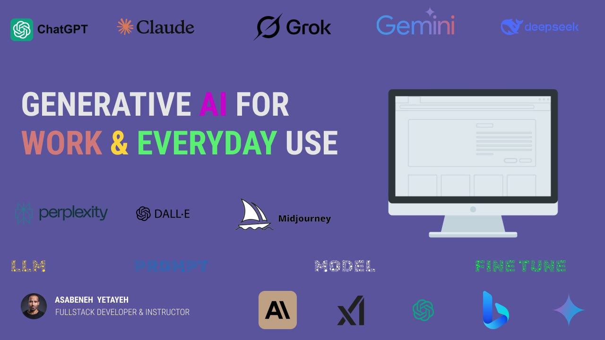

# 🎓 **Generative AI for Work and Daily Use**

**Autumn 2025**
**Instructor:** Asabeneh Yetayeh



## **Module 1: Introduction to Generative AI**

### 🎯 Learning Objectives

By the end of this module, learners should be able to:

* Explain what Generative AI is and how it differs from traditional AI.
* Understand how generative models such as GPT and diffusion models work.
* Identify popular Generative AI tools and their use cases.

### 📘 Explanation

Generative Artificial Intelligence refers to a class of AI systems capable of **creating new content**—such as text, code, music, or images—based on what they have learned from vast datasets.

Traditional AI systems *analyze or classify* data (e.g., detecting spam), while Generative AI *produces* new, original outputs (e.g., writing an email or creating a picture).

#### ⚙️ How It Works

Most modern Generative AI tools are built using:

* **Transformers:** The architecture behind models like GPT, Claude, Gemini, and Llama.
* **Diffusion Models:** Used in image generation tools like DALL·E, Midjourney, and Stable Diffusion.
* **GANs (Generative Adversarial Networks):** One neural network creates data while another evaluates it.

#### 🧠 Real-world Analogy

Think of Generative AI like an *advanced autocomplete system*.
When you start typing, it predicts what you might say next—but it can do this for **entire essays, images, code, or even videos**.

### 🧩 Examples

* ChatGPT writing a professional email.
* DALL·E generating a logo for a business idea.
* Copilot suggesting entire blocks of code.

### 🧪 Exercise

1. In your own words, explain the difference between **traditional AI** and **Generative AI**.
2. Research and list 3 Generative AI tools and describe their main purpose.
3. Use ChatGPT to generate a motivational quote and rewrite it in a funny tone.

### 📝 Quiz

1. What is the main goal of Generative AI?
   a) Classification
   b) Prediction
   c) Creation ✅
   d) Optimization

2. Which of the following models is used for image generation?
   a) Transformer
   b) Diffusion ✅
   c) RNN
   d) CNN

3. True or False: GANs involve two neural networks competing with each other.
   ✅ True

---

## **Module 2: Everyday Use Cases**

### 🎯 Learning Objectives

* Recognize how Generative AI can improve daily productivity.
* Learn to apply AI tools in learning, writing, and communication.
* Explore creative personal applications of AI.

### 📘 Explanation

Generative AI isn’t just for developers—it’s for everyone. It can act as your **personal assistant**, **creative partner**, or **learning companion**.

#### 💼 Productivity Examples

* Summarize meeting notes using ChatGPT.
* Draft and polish emails in seconds.
* Plan daily schedules or meal plans.

#### 📚 Learning and Education

* Use AI as a tutor to explain difficult concepts.
* Generate quizzes and flashcards for revision.
* Summarize chapters or articles for faster learning.

#### 🎨 Creativity and Entertainment

* Generate art, logos, or character designs.
* Write poems, stories, or lyrics.
* Create social media posts or captions.

### 🧪 Exercise

1. Ask ChatGPT to create a **daily to-do list** for a software developer.
2. Use an image tool like **Canva Magic Studio** or **DALL·E** to design a poster for a personal project.
3. Use AI to summarize an online article of your choice in 3 bullet points.

### 📝 Quiz

1. Which of the following is **not** a common personal use of Generative AI?
   a) Summarizing notes
   b) Automating factory machines ✅
   c) Writing social media posts
   d) Translating text

2. True or False: Generative AI can create personalized workout plans.
   ✅ True

3. Fill in the blank: AI can be your ______ in learning new subjects.
   ✅ Tutor

---

## **Module 3: Workplace Applications – Content Creation**

### 🎯 Learning Objectives

* Explore how AI enhances writing, design, and media production.
* Learn effective prompting for professional content creation.
* Understand how to maintain authenticity when using AI tools.

### 📘 Explanation

Generative AI can create blogs, reports, visuals, and more—helping professionals save time and boost creativity.

#### ✍️ Writing and Communication

* Draft marketing content and press releases.
* Generate SEO-optimized articles or ad copy.
* Edit for grammar, tone, and engagement.

#### 🎨 Design and Media

* Generate images for blogs or presentations.
* Use AI video tools (like RunwayML) for quick video edits.
* Produce mockups and visual prototypes.

#### 💡 Best Practices

* Always edit and fact-check AI-generated content.
* Maintain a human voice and ethical transparency.

### 🧪 Exercise

1. Use ChatGPT to generate a 150-word LinkedIn post about “AI in Education.”
2. Create an image that visually represents your post using DALL·E or Canva Magic Studio.
3. Edit the AI’s draft to reflect your personal tone and style.

### 📝 Quiz

1. Which of the following is a risk of using AI in content creation?
   a) Increased creativity
   b) Reduced accuracy ✅
   c) Better time management
   d) Improved visuals

2. What should you always do after generating content with AI?
   ✅ Review, edit, and verify the facts.

---

## **Module 4: Workplace Applications – Automation and Analysis**

### 🎯 Learning Objectives

* Automate repetitive workflows using AI tools.
* Use AI for data summarization and decision support.
* Identify popular integrations and productivity platforms.

### 📘 Explanation

Generative AI isn’t limited to writing—it can automate processes and analyze data intelligently.

#### ⚙️ Examples

* Automatically draft meeting summaries.
* Generate reports from Excel data.
* Use AI chatbots for customer support.

#### 🔗 Integrations

* **Zapier + OpenAI** for workflow automation.
* **Microsoft Copilot** for AI assistance in Word, Excel, and PowerPoint.
* **Notion AI** for intelligent note management.

### 🧪 Exercise

1. Use ChatGPT to summarize a 2-page report into bullet points.
2. Design a simple automation plan: “When I receive an email about a meeting, automatically create a calendar event.”
3. Create a chatbot prompt for responding to a customer query.

### 📝 Quiz

1. Which tool can automate workflows using AI?
   ✅ Zapier
2. True or False: Generative AI can extract key points from long documents.
   ✅ True

---

## **Module 5: Hands-On with Visual and Coding Tools**

### 🎯 Learning Objectives

* Practice using text-to-image and text-to-code tools.
* Develop small projects combining multiple AI tools.
* Understand how to refine prompts for better results.

### 📘 Tools Overview

* **ChatGPT / Copilot:** Coding assistance and debugging.
* **DALL·E / Midjourney:** Text-to-image generation.
* **RunwayML / Pika:** Video generation.

### 🧪 Exercises

1. Generate an image of a “Futuristic Classroom” using an image AI.
2. Ask ChatGPT to write a JavaScript function that reverses a string.
3. Use Copilot to optimize the code.

### 📝 Quiz

1. Which of the following tools can generate code?
   ✅ GitHub Copilot
2. True or False: Midjourney is used for coding.
   ❌ False

---

## **Module 6: Advanced Applications and Workflows**

### 🎯 Learning Objectives

* Combine tools to build automated pipelines.
* Learn how to create and integrate custom AI agents.
* Understand the concept of fine-tuning and personalization.

### 📘 Explanation

Advanced AI workflows connect multiple tools for automation and creativity:

* **Idea → Draft → Visual → Publish**
* **Data → Analyze → Visualize → Summarize**

You can even create personal AI agents that assist with emails, scheduling, or content production.

### 🧪 Exercise

1. Create a workflow that uses ChatGPT for content, Canva for visuals, and Notion for publishing.
2. Plan a custom AI chatbot for a specific role (e.g., a writing coach or study assistant).

### 📝 Quiz

1. What is “fine-tuning” in AI?
   ✅ Training a model on specialized data to improve task-specific performance.

---

## **Module 7: Ethics, Limitations, and Best Practices**

### 🎯 Learning Objectives

* Understand ethical concerns in AI-generated content.
* Recognize limitations and biases of Generative AI.
* Learn responsible and transparent AI use.

### 📘 Key Points

* **Transparency:** Always disclose AI involvement.
* **Bias Awareness:** AI reflects the data it was trained on.
* **Privacy:** Avoid sharing personal or confidential information.

### 🧪 Exercise

1. Find an example of biased AI output and discuss how to fix it.
2. Write a short paragraph explaining why ethical AI use matters.

### 📝 Quiz

1. True or False: AI-generated text can be published without review.
   ❌ False
2. What is one ethical principle of AI use?
   ✅ Transparency

---

## **Module 8: Capstone Project and Course Wrap-Up**

### 🎯 Objective

Apply everything you’ve learned in a practical, creative project.

### 📘 Project Options

1. **AI-Powered Blog:** Automate article writing and visuals.
2. **Personal Assistant:** Build a daily planner using ChatGPT + Zapier.
3. **AI Story Generator:** Combine ChatGPT + DALL·E to create visual stories.

### 📋 Submission Requirements

* Describe your goal, tools, and workflow.
* Showcase results (e.g., link, screenshots, or demo).
* Reflect on lessons learned and ethical considerations.


## Some of the common GenAI
- [ChatGPT](https://chatgpt.com/)
- [Gemini](https://gemini.google.com/)
- [Grok](https://grok.com/)
- [Claude](https://claude.ai/)
- [Deepseek](https://www.deepseek.com/en)
  
## Code formatting use Markdown

Some snippet of code in JavaScript
```javascript

const makeSquare = (n) => {
    return n ** 2
}
console.log(makeSquare(2)) # 4
console.log(makeSquare(5)) # 25
```
Some snippet of code in Python

```python

def make_square (n):
    return n ** 2

print(make_square(2)) # 4
print(make_square(5)) # 25
```
